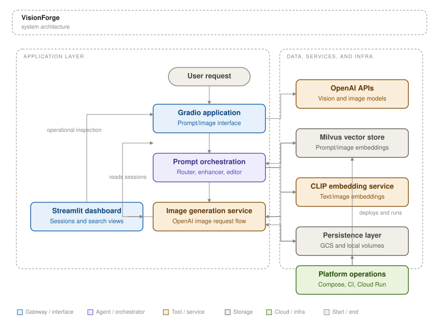
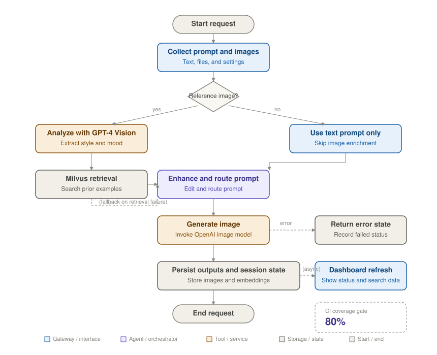

# VisionForge

> Milvus-backed AI image generation platform that analyzes reference images, enriches prompts, and serves generation workflows through Gradio and Streamlit interfaces.


---

## Overview

VisionForge is a multi-service image generation platform built by Manichandra Reddy Bethi for teams that need stronger prompt quality, reusable visual context, and searchable generation history in a single workflow. It combines a Gradio creation interface, a Streamlit dashboard, OpenAI image and vision models, CLIP embeddings, and Milvus vector search to improve prompt construction and image reuse. The system runs locally as a Docker Compose stack with Milvus, MinIO, and etcd, and it also includes GitHub Actions pipelines for container build, test, and Google Cloud Run deployment. Generated images are written to Google Cloud Storage, while prompt, input-image, and output-image embeddings are stored in Milvus for later retrieval and dashboard inspection.

## Architecture



> End-to-end component view of the Gradio generation app, prompt orchestration modules, OpenAI model calls, Milvus retrieval layer, storage services, dashboard, and deployment infrastructure.

## Workflow



> Request lifecycle from user input through reference-image analysis, prompt enhancement, optional vector retrieval, image generation, persistence, and dashboard refresh.

## Tech stack

| Category | Technology | Purpose |
|----------|-----------|---------|
| Language | Python 3.12 | Application runtime defined in the Docker image and CI workflow |
| Framework | Gradio | Primary image generation interface served from `src/app.py` |
| Framework | Streamlit | Operational dashboard for sessions, searches, and generation metrics |
| ML / AI | OpenAI image API | Generates final images from enhanced prompts |
| ML / AI | GPT-4 Vision Preview | Analyzes uploaded reference images before prompt construction |
| ML / AI | CLIP (`openai/clip-vit-base-patch32`) | Produces text and image embeddings for similarity search |
| ML / AI | Hugging Face Transformers | Loads CLIP model and processor |
| Vector store | Milvus 2.3.3 | Stores prompt, input-image, and output-image embeddings |
| Database | etcd 3.5.5 | Metadata backend used by the local Milvus deployment |
| Cloud | Google Cloud Storage | Stores generated images with prompt metadata |
| Cloud | Google Cloud Run | Hosts the deployed application in `us-central1` |
| Cloud | Google Container Registry | Stores built container images from GitHub Actions |
| Containerisation | Docker | Builds the application image and packages runtime dependencies |
| Containerisation | Docker Compose | Runs the application, dashboard, and Milvus services together |
| CI / CD | GitHub Actions | Builds, tests, and deploys the project |
| Monitoring | Streamlit dashboard | Exposes session counts, generation status, and similarity-search inspection |

## Repository structure

```text
VisionForge/
├── assets/                    # GitHub-rendered architecture and workflow diagrams
├── docs/                      # Deployment notes and environment-specific operating guidance
│   └── deployment.md          # Local, development, and Cloud Run deployment documentation
├── src/                       # Application source code
│   ├── app.py                 # Gradio entry point for prompt orchestration and image generation
│   ├── dashboard/             # Streamlit dashboard for session and similarity-search inspection
│   ├── image_generator.py     # OpenAI image generation and Google Cloud Storage upload logic
│   ├── milvus_utils.py        # Milvus connection, schema, indexing, and embedding utilities
│   └── prompting/             # Prompt routing, enhancement, editing, and image description modules
├── tests/                     # Automated tests for image-generation flows
│   ├── conftest.py            # Shared pytest fixtures and test configuration
│   └── test_image_generator.py # Validation for generation behavior
├── .env.example               # Required environment variable names
├── .github/workflows/         # CI, build, and deployment pipelines
├── Dockerfile                 # Python 3.12 container image definition
├── docker-compose.yml         # Local multi-container runtime with Milvus dependencies
└── requirements.txt           # Python dependency manifest
```

## Getting started

### Prerequisites

- Docker
- Docker Compose
- Python 3.12

### Installation

```bash
git clone https://github.com/Manireddy1508/VisionForge.git
cd VisionForge
docker compose build
```

### Configuration

| Variable | Purpose |
|----------|---------|
| `OPENAI_API_KEY` | Authenticates OpenAI vision and image generation requests |
| `OPENAI_IMAGE_MODEL` | Selects the image model used by the generator |
| `MILVUS_HOST` | Points the application and dashboard to the Milvus host |
| `MILVUS_PORT` | Sets the Milvus service port |
| `GCS_BUCKET_NAME` | Target Google Cloud Storage bucket for generated images |
| `GOOGLE_CLOUD_PROJECT` | Google Cloud project identifier used by the runtime environment |

### Run

```bash
docker compose up --build
```

## Author

**Manichandra Reddy Bethi** — Machine Learning Engineer  
Portfolio: [bethimanichandrareddy.com](https://bethimanichandrareddy.com)  
GitHub: [Manireddy1508](https://github.com/Manireddy1508)  
LinkedIn: [bethimanichandrareddy](https://linkedin.com/in/bethimanichandrareddy)

## License

MIT © Manichandra Reddy Bethi
